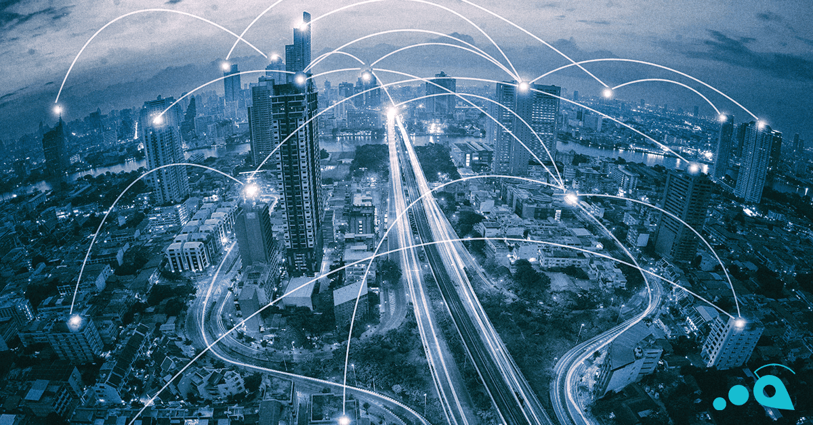

> “A customer is the most important visitor on our premises, he is not dependent on us. We are dependent on him. 
> He is not an interruption in our work. He is the purpose of it. 
> He is not an outsider in our business. He is part of it. 
> We are not doing him a favour by serving him. He is doing us a favour by giving us an opportunity to do so.”
> 
> **Mahatma Gandhi**

We are right in the middle of the Christmas peak and people are bustling in shops decorated by blinking coloured lights. Customers also order a lot of packages online and expect to receive them in time. The problem is that delivery companies are overwhelmed by thousands and thousands of orders and are truly struggling to deliver all the packages in time for Christmas. This can be explained by a lack of seasonal workers or a too high volume of items to deliver. 

Several solutions however do exist to ensure deliveries in due time:

## 1. Prepare your shipping strategy before Christmas

In order to provide efficient delivery services during the holiday season, you will have to prepare an adequate strategy that will allow you to deliver what you promised, in an easier way. The first thing to remember is to make use of automated communication technologies between key sections, such as the warehouses and the accounting departments. 

You can then implement an omni-channel fulfilment system. For example, if you know that you will be able to make roughly 5,000 deliveries each day during the holiday season, set this daily limit in your system and allow your customers to only choose the available slots within your available delivery windows. Allow them to also change their order until the day of the delivery, provided that slots are still available. 

Set-up an inventory of all the countries you will ship to along with the special events that are celebrated in these countries (Halloween, Christmas, etc.). This will allow you to set deadlines for each and every country as regards the cut-off point at which customers will have to place their order.

You can also make use of a routing and scheduling system that will constantly update the delivery routes to enhance your drivers and vehicles’ proficiency. By designing your product groupings for an optimal size and weight, you will be able to ensure trucks always carry full loads along with using proper delivery routes. 

Do not forget to prepare your shipping team. First, let your employees know that there will be an increase in shipments at specific periods of the year. Organize then the following aspects:
•	The volume of your deliveries: increase your employees’ efficiency, as they will have to process more orders each day so that they will have to move quicker while preserving their accuracy. 
•	Specific Supply Tasks (e.g. goodies, gift-wraps, personalization): do not forget that somebody has to be held responsible for dealing with these tasks (if applicable in your activities). 
•	Train your staff to provide strategic sequencing as well as to make use of vertical storage.

## 2. Optimise your logistics during the holiday season

> “Eighty-five percent of the reasons for failure are deficiencies in the systems and process rather than the employee. 
> The role of management is to change the process rather than badgering individuals to do better.”
> 
> **W. Edwards Deming**

To optimise your logistics and to provide the promised service levels as regards the amount of delivered packages, you can first decide to increase the number of seasonal workers (e.g. package sorters, loaders, delivery helpers or drivers) along with extra aircraft, trucking rotations or shifts to hubs if you are a massive delivery company.

In order to decrease the amount of work for your customer service, make use of an automated customer notification system like an online platform showing the complete order lifecycle. This will reduce the volume of customers’ inbound calls and increase their confidence in your delivery service. 

Continuously improve your strategy by encouraging feedbacks and suggestions from both your customers and your staff.

## The Take-Away

In this article, you have learned about the levers that could help you deal with peak delivery periods:

* Prepare a strategy beforehand,  make use of 
    * automated communication technologies 
    * an omni-channel fulfilment system with an on-demand option
    * a routing and scheduling systems
    * … but also prepare your shipping team adequately
* During the peak delivery period, 
    * increase the number of seasonal workers, of vehicles, or shifts
    * make use of automated customer notifications
    * ask for feedback or suggestions 

