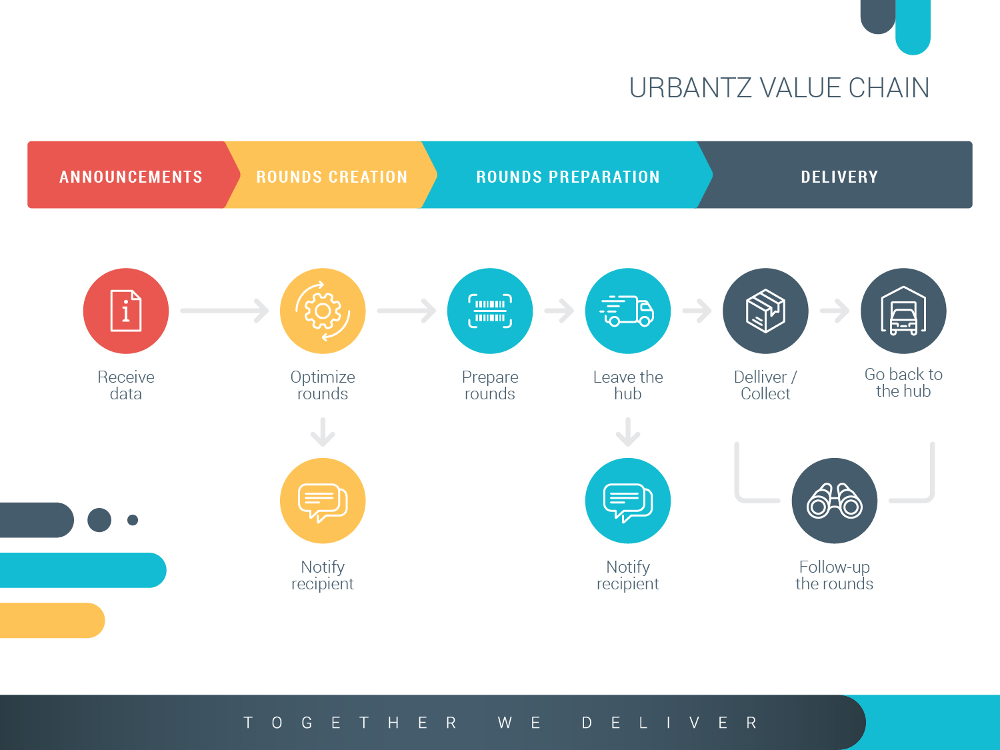

Though the core process is well defined, URBANTZ allows for a host of customisations at many levels, and adapts to many variations of the standard delivery model. When you create a delivery flow you can adapt the process in URBANTZ. The high level end-to-end last mile process shows examples of customisations possible with URBANTZ.
With URBANTZ you can mix in the same round parcels that have different delivery flows. In this case URBANTZ will automatically manage the flows and the driver just has to follow instructions.

The schema below is a high level view of the delivery end-to-end process. The stickers on the schema indicate a step in the process that is customisable.

{.thumbnail .thumbnail-wide}

1.	Optimisation: Can this set of parcels be consolidated with that other one, or not?, 
2.	Carrier feedback information: Do you want to inform your carrier of the rounds and sequence assigned to each parcel for pre-preparation?
3.	Round preparation: Does the dispatcher need to scan the parcel or not?
4.	Driver round preparation: Does the driver need to scan the parcel prior to delivery, or just check the number of parcels, etc.? 
5.	Internal alerts: Do you want to send internal alerts if the round start is delayed?
6.	End customer notification: Do you want to notify the end customer, when, how?
7.	POD management: Does this carrier require a customer signature, a picture, or not? 
8.	Etc.