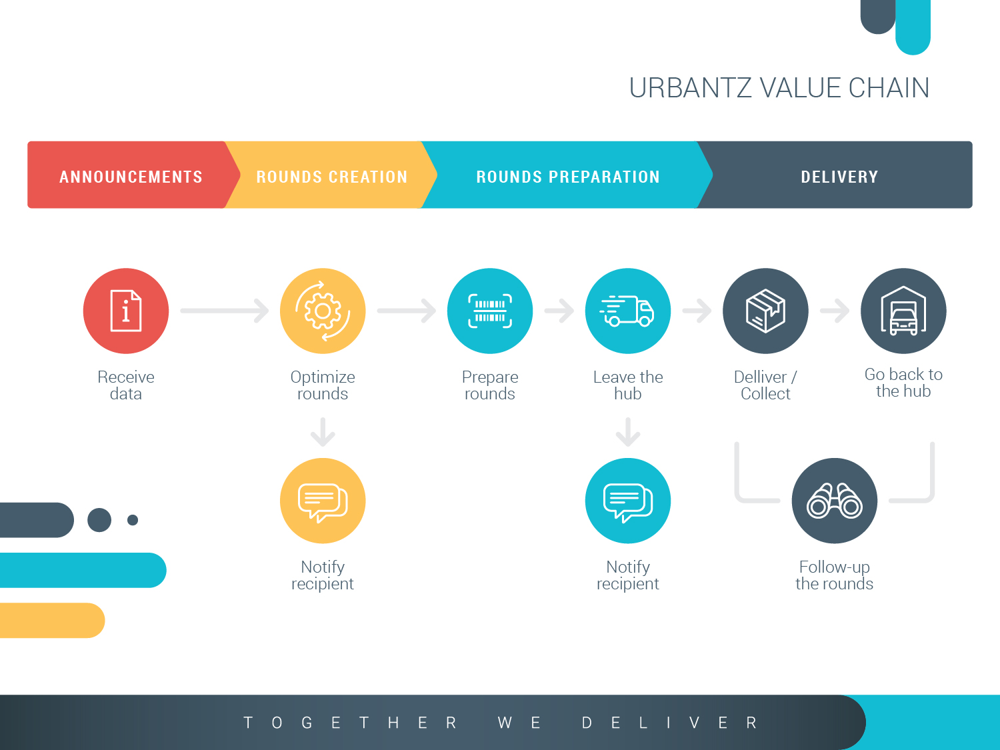

Bien que le processus de base soit bien défini, URBANTZ autorise un personnalisation à plusieurs niveaux, et s'adapte parfaitement aux différentes modifications du modèle de livraison standard. A chaque flux de livraison créé, le processus est adaptable dans URBANTZ. La vision globale du sytème de livraison de bout en bout montre des exemples de personnalisations possibles avec URBANTZ.
Grâce à Urbantz une tournée peut contenir des colis provenant de plusieurs flux différents. Dans ce cas, URBANTZ gèrera automatiquement les différents flux et le livreur n'aura plus qu'à suivre les instructions.

Le schéma ci-dessous est une vision d'ensemble du processus de livraison de bout en bout. Les différents labels représentent les étapes personnalisables du processus.

{.thumbnail .thumbnail-wide}

1.	Optimisation: Cet ensemble de colis peut-il être consolidé par un autre, ou pas?
2.	Feedback au transporteur: Souhaitez-vous informer votre transporteur de la tournée et de la séquence attribuée à chaque colis?
3.	Préparation des tournées: le dispatcher doit-il scanner les colis, ou pas?
4.	Préparation des tournées des livreurs: le livreur doit-il scanner les colis avant la livraison, ou simplement vérifier le nombre de colis, etc.? 
5.	Alertes internes: Souhaitez-vous envoyer des alertes internes lorsqu'une tournée est retardée?
6.	Notification au consommateur final: Souhaitez-vous notifier le consommateur final?, quand?, comment?
7.	Gestion des accusés: le transporteur a-t-il besoin d'une signature du client, ou une photo, ou pas? 
8.	Etc.